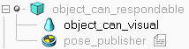

# Add Manipulated Objects to Scene
In this project, when you want to use some object in the simulation, you need to provide both collision mesh (better to be simple) and visual mesh. After you import both of them in the simulation, you need to set the visual mesh as a child of the collision mesh and set the collision mesh as the model. For example, you have "can" object, and you need to name both meshes as "object_can_respondable" and "object_can_visual" respectively. By the way, you need to overlap them in simulation. For easily accessing its pose later, you need to have a pose publisher for each desired object to publish its tranform into the tf tree. To do that, you need to create a dummy node with a [child script](pose_publisher.txt) as another child of the collision mesh. The final hieracrchy structure of the object is shown as below




In this project, we have a fake object segmentation in simulation. The segmentation result will be published in topic **"/head_camera/seg/image_rect_color"**, while the list of pair (segmentation color and name) is in the topic **"/segmented_object_list/objects"**.

Moreover, to get the color of each object quickly, you can run in terminal with the following command
```
rostopic echo -n 1 /segmented_object_list/objects | grep -E 'name|rgb' | awk 'NR%2==0 {print p,$0} {p=$0}'
```